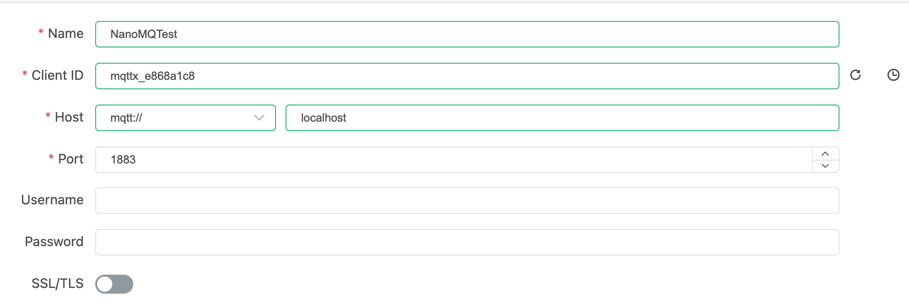

# MQTT over TCP Bridge

MQTT over TCP Bridging serves as a reliable communication strategy, leveraging the trustworthiness of the Transmission Control Protocol (TCP) to ensure the accuracy and integrity of MQTT messages during cross-network or cross-proxy communications. With the flexibility to adapt to various network environments and application scenarios, it plays a pivotal role in facilitating communication between Internet of Things (IoT) devices. 

NanoMQ now supports MQTT over TCP bridging, enabling connections to the [EMQX Enterprise MQTT IoT Access Platform](https://www.emqx.com/products/emqx).

## Configure MQTT over TCP Bridge

NanoMQ comes with built-in support for MQTT over TCP bridging. Thus, after [installing NanoMQ](../installation/introduction.md) through any given method, you can immediately configure and enable MQTT over TCP bridging via the configuration file.

This section utilizes EMQ's [free public bridge broker.emqx.io:1883](https://www.emqx.com/en/mqtt/public-mqtt5-broker) to establish MQTT over TCP data bridging. Insert the following content (in HOCON format) into the configuration file:

:::: tabs type:card

::: tab HOCON

Users wishing to use the HOCON configuration format can refer to the following structure and write their configurations into the `nanomq.conf` file. The relevant settings will take effect after NanoMQ is restarted.

- For a complete list of configuration options, refer to [Configuration Description - v019](../config-description/v019.md)
- For users of NanoMQ versions 0.14 ~ 0.18, please refer to [Configuration Description - v0.14](../config-description/v014.md)

```bash
bridges.mqtt.name {
	## TCP URL format:  mqtt-tcp://host:port
	## TLS URL format:  tls+mqtt-tcp://host:port
	## QUIC URL format: mqtt-quic://host:port
	server = "mqtt-tcp://broker.emqx.io:1883"
	## MQTT protocol version（4 ｜ 5）
	proto_ver = 4
	# username = admin
	# password = public
	clean_start = true
	keepalive = 60s
	## Uncomment if you need TLS
	## ssl {
	## 	keyfile = "/etc/certs/key.pem"
	## 	certfile = "/etc/certs/cert.pem"
	## 	cacertfile = "/etc/certs/cacert.pem"
	## }
	forwards = ["forward1/#","forward2/#"]
	subscription = [
		{
			topic = "recv/topic1"
			qos = 1
		},
		{
			topic = "recv/topic2"
			qos = 2
		}
	]
	max_parallel_processes = 2 
	max_send_queue_len = 1024
	max_recv_queue_len = 1024
}
```
:::

::: tab KV format

Users wishing to use the KV configuration format can refer to the following structure and write their configurations into the `nanomq_old.conf` file. The relevant settings will take effect after NanoMQ is restarted.

- For a complete list of configuration options, refer to [Configuration Description - v013](../config-description/v013.md)

```bash
bridge.mqtt.emqx.bridge_mode=true
bridge.mqtt.emqx.address=mqtt-tcp://your_server_address:port
bridge.mqtt.emqx.proto_ver=4
bridge.mqtt.emqx.clientid=bridge_client
bridge.mqtt.emqx.clean_start=false
bridge.mqtt.emqx.forwards=topic1/#,topic2/#
bridge.mqtt.emqx.subscription.1.topic=cmd/topic1
bridge.mqtt.emqx.subscription.1.qos=1
bridge.mqtt.emqx.parallel=2
bridge.mqtt.emqx.max_send_queue_len=32
bridge.mqtt.emqx.max_recv_queue_len=128
```

:::

::::

::: tip

Using `mqtt-tcp` as the URL prefix signifies the use of TCP as the transport layer for MQTT.

:::

**Key Configuration Items**

- Remote broker address: `bridges.mqtt.name.server`
- Array of remote topics to forward (supporting MQTT wildcard): `bridges.mqtt.name.forwards`
- Array of remote topics to subscribe to (supporting MQTT wildcard): `bridges.mqtt.name.subscription`

If using Hocon version configuration items and NanoMQ version >= 0.19, you can either directly write the related configurations into `nanomq.conf`, or create a separate configuration file for bridging, such as `nanomq_bridge.conf`, and use HOCON's `include` syntax to reference this file in `nanomq.conf`:

Example:

```bash
include "path/to/nanomq_bridge.conf" 
```

To view more log data during runtime, you can set the log level `log.level` in the configuration file.

## Start NanoMQ

When launching NanoMQ, use the `--conf` command line option to specify the path to the configuration file (If the configuration file is already located in the system path `/etc/nanomq.conf`, there's no need to specify it in the command line).

:::: tabs type:card

::: tab Hocon Configuration Format

```bash
$ nanomq start --conf nanomq.conf
```

:::

::: tab Old Configuration Format

```bash
$ nanomq start --old_conf nanomq.conf
```

:::

::::

Tips: If you enabled SQLite feature, NanoMQ will automatically flush cached messages into disk when network is disconnected. NanoMQ will resend cached messages once bridging connection is restored. But each cached message will be resent in a certain interval to avoid bandwidth exhaustion.

## Test the Bridge

This section will guide you in testing the newly established MQTT data bridge using the [MQTTX Client Tool](https://mqttx.app/). We will create two connections, one to NanoMQ and the other to the MQTT data bridge, to verify the message sending and receiving services of both NanoMQ and the data bridge.

**Client connecting NanoMQ**



**Client connecting MQTT bridge**


**Verify messging from NanoMQ to MQTT bridge**

On your client connecting the MQTT bridge, `MQTTbridge` in this example, subscribe to the `forward1/#` topic.

On your client connecting NanoMQ, `NanoMQTest` in this example, publish a message to the `forward1/msg` topic, for example, `Hello from NanoMQ`

Verify that you received the message that was published from the local broker.


**Verify the messaging from MQTT to NanoMQ**

On your client connecting NanoMQ, `NanoMQTest` in this example, subscribe to the `recv/topic1` topic.

On your client connecting the MQTT bridge, `MQTTbridge` in this example, publish a message to the `recv/topic1` topic, for example, `Hello from broker.emqx.io`

Verify that you received the message that was published from broker.emqx.io.


If you're interested in evaluating the performance of MQTT over QUIC bridging, you can conduct a benchmark test. Please refer to the guide available at [Toolkit - Bench](../toolkit/bench.md) for detailed instructions.
