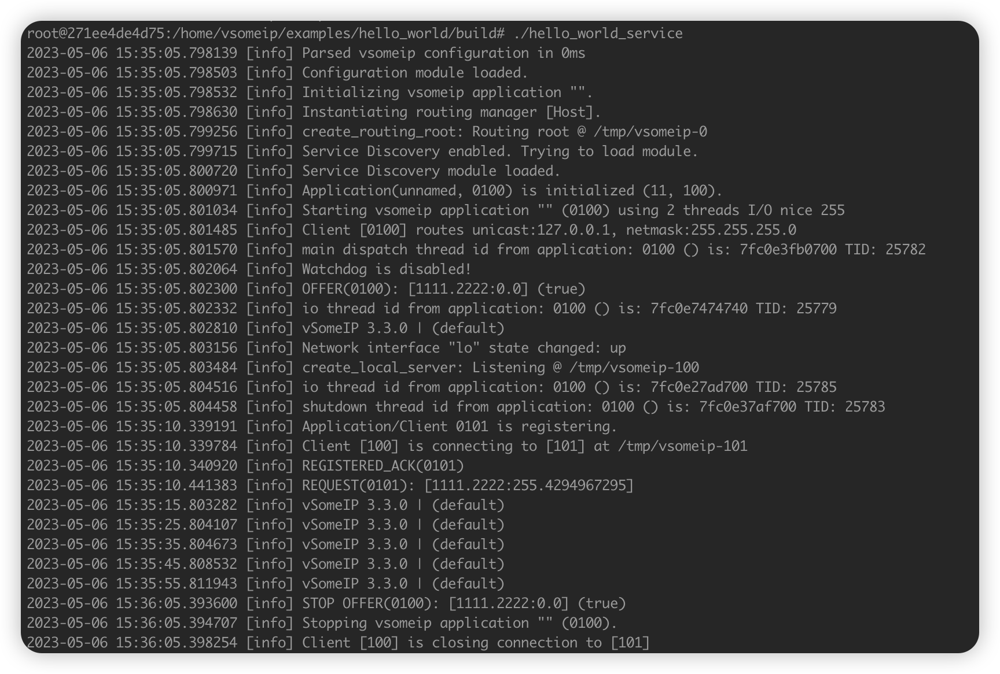
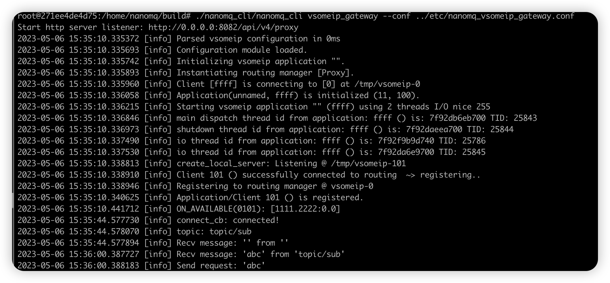
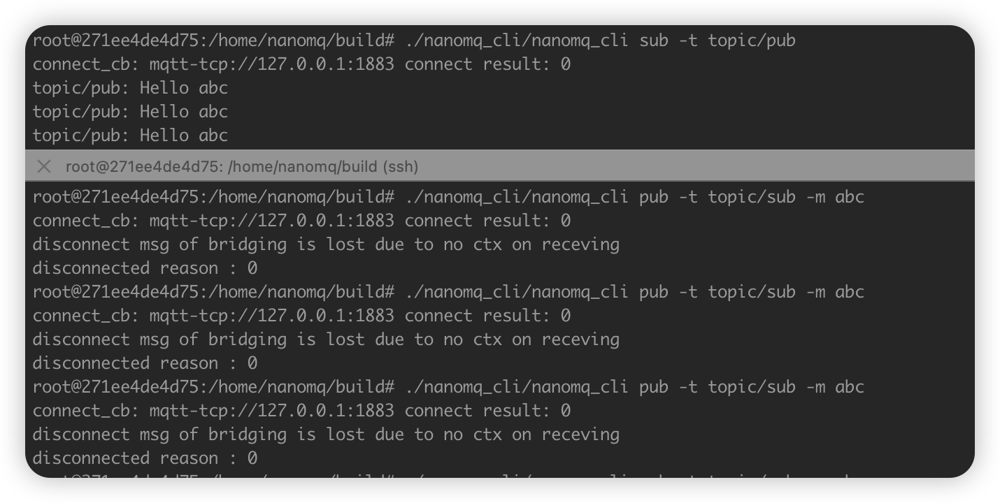

# SOME/IP GATEWAY

## Dependencies

Currently, the functionality of someip-gateway relies on [vsomeip](https://github.com/COVESA/vsomeip).

### Installing vsomeip

Please refer to [vsomeip](https://github.com/COVESA/vsomeip) for installation instructions for the required dependencies. The following assumes that the relevant dependencies have been installed.

```shell
git clone https://github.com/COVESA/vsomeip.git
cd vsomeip
mkdir build
cd build
cmake -DCMAKE_INSTALL_PREFIX:PATH=$YOUR_PATH
make -j8
make install
```

### Compile hello_world_service

```shell
cd vsomeip/examples/hello_world
mkdir build
cd build
cmake ..
make -j8
```

## Compile

Enable SOME/IP protocol conversion for NanoMQ during the compilation phase with the following command:

```shell
cmake -G Ninja -DBUILD_VSOMEIP_GATEWAY=ON ..
ninja
```

## Running the Gateway

Before starting to use it, configure the bridged topics and the SOME/IP service address for request through the independent configuration file `etc/nanomq_vsomeip_gateway.conf`. For example, with this configuration, the data received from the SOME/IP service will be forwarded to the topic/pub topic of the local MQTT Broker, and the MQTT messages received from the topic topic/sub will be forwarded to the SOME/IP service.

```apache
##====================================================================
# # Configuration for MQTT VSOMEIP Gateway
# #====================================================================
gateway.mqtt {
    address = "mqtt-tcp://localhost:1883"
    sub_topic = "topic/sub" # message from mqtt
    sub_qos = 0
    proto_ver = 4
    keepalive = 60
    clean_start = true
    username = "username"
    password = "passwd"
    clientid = "vsomeip_gateway"
    forward = "topic/pub" # message to mqtt
    parallel = 2
}

gateway.vsomeip {
    service_id = "0x1111"
    service_instance_id = "0x2222"
    service_method_id = "0x3333"
    # conf_path = "/etc/vsomeip.json"
}

# #============================================================
# # Http server
# #============================================================
http_server {
    # # allow http server
    # #
    # # Value: true | false
    enable = false
    # # http server port
    # #
    # # Value: 0 - 65535
    port = 8082
    # # parallel for http server
    # # Handle a specified maximum number of outstanding requests
    # #
    # # Value: 1-infinity
    parallel = 2
    # # username
    # #
    # # Basic authorization
    # #
    # # Value: String
    username = admin
    # # password
    # #
    # # Basic authorization
    # #
    # # Value: String
    password = public
}
```

To connect and forward to the SOME/IP service, which is the example service `hello_world_service` provided by the VSOMEIP project, start the SOME/IP gateway to integrate with NanoMQ. (Please refer to the VSOMEIP project documentation for instructions on how to install and start this example service. This service can also be replaced with other SOME/IP compatible services.)

```shell
ldconfig
./hello_world_service // Launch SOME/IP Server
nanomq start // Launch NanoMQ MQTT Broker
nanomq_cli vsomeip_gateway --conf ../etc/nanomq_vsomeip_gateway.conf // Launch SOME/IP proxy
```

Afterwards, sending a message in the `topic/pub` topic will receive a response message from the `hello_world_service` in the corresponding `topic/sub` topic.

Running as shown in the figure:    

Currently, only transparent pass-through service is provided. In the future, automatic code generation and serialization functions similar to the DDS Proxy Gateway will be provided based on the data serialization/deserialization format tools used by users, such as IDL/FIDL.
